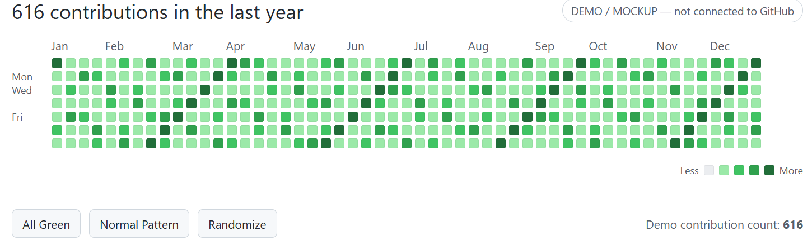

 

---

## 👨‍💻 WHO AM I?

### Hi, I'm Muhammad Faizan 👋

**Data Science Student • Web Developer • Software Developer**

I love turning ideas into real-world software and continuously improving my development skills.

🎓 **BS Mathematics with Data Science** — COMSATS University Islamabad, Lahore Campus

💻 Focused on **Web Development, Software Development, Java, Python & JavaScript**

🚀 Exploring **AI, Automation & Modern Software Development**

---

## ⚡ Tech Stack

  

---

## 📊 Contribution Activity

---

## 🚀 Featured Work

<table width="90%">
<tr>

<td width="33%" align="center" valign="top">

  

<h3>WSU Consultant</h3>

Education & Study Abroad Consultancy Website.

  

</td>

<td width="33%" align="center" valign="top">

  

<h3>Best Sourcing</h3>

Premium garments sourcing website with a modern UI.

  

</td>

<td width="33%" align="center" valign="top">

  

<h3>Web Rise Media</h3>

Digital services agency for web development, SEO & digital marketing.

  

</td>

</tr>
</table>

---

## 🌐 Let's Connect

<table width="85%">
<tr>

<td align="center" width="20%">

 
<b>GitHub</b>
</td>

<td align="center" width="20%">

 
<b>Instagram</b>
</td>

<td align="center" width="20%">

 
<b>WhatsApp</b>
</td>

<td align="center" width="20%">

 
<b>YouTube</b>
</td>

<td align="center" width="20%">

 
<b>Facebook</b>
</td>

</tr>
</table>

 

  

